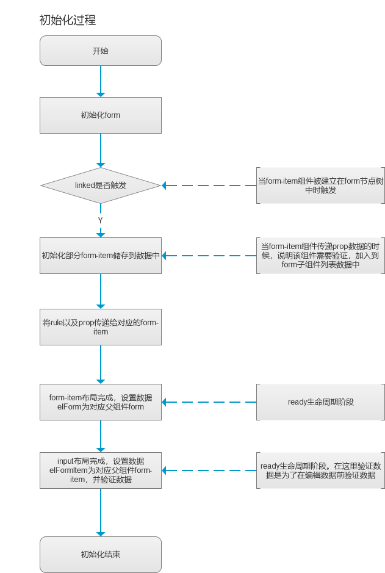
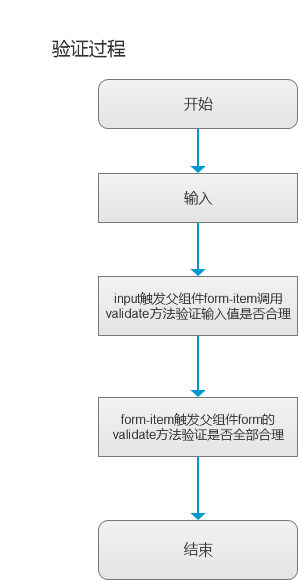

# 使用 async-validator 编写 小程序表单实时验证组件

## 目录

- 前言
- 前置知识
- 需求简介
- 实现思路简介
- 主要代码
- 程序代码地址
- 后话

## 前言

因为接到 “小程序表单实时验证提示错误信息” 的需求，而翻遍网络小程序表单验证，均是使用 WxValidate 在表单提交时进行判断，不满足需求，遂自定义实现该需求。

## 前置知识

- [async-validator github 地址](https://github.com/yiminghe/async-validator)
  因为 async-validator 可以对数据进行异步校验，并且是个很纯粹的 js 库，所以选择这个库来进行校验

- [拜读及分析 Element 源码-form 表单组件篇](https://juejin.im/post/5b99ff0af265da0a8a6a9439)
  这篇博客浅显易懂的解释了 element 表单验证源码过程，理解了这个，对于构建组件的思路很有建设性帮助哦 o(_￣︶￣_)o

- [组件间关系](https://developers.weixin.qq.com/miniprogram/dev/framework/custom-component/relations.html)
  实现 form 和 form-item 以及 form-item 和 input/picker 之间关系的文档

## 需求简介

1. 输入框输入或选择框选择时实时验证是否符合规范，不符合时底部显示错误提示，符合时不提示
2. 编辑时验证后台接口返回数据是否均符合规范（历史遗留，数据库中会有不符合规范的数据），如有不符合的提示
3. 输入框或选择框未进行操作（未获取焦点），表单提交的时候整体验证，不符合规范的均提示

## 实现思路简介

### 思路简介

> 实现思路均参考 Element-ui 中表单验证的思路

1.  创建 form-item 组件，作为输入框（input）和选择框（picker）的父组件，用来校验 input/picker 的合法性以及错误的显示和隐藏

2.  创建 form 组件，作为多个 form-item 的父组件，用来验证所有 form-item 下的组件的合法性，均合法时返回 true，否则返回 false

---

### 思路简图（这里均以 input 为例）

1. 初始化的过程

- 在 form 的初始化过程中，需要将内部的需要验证的子组件 form-item（带有 prop 属性的组件为需要验证的组件）储存到一个变量中，方便后期使用。

  > 这里只保存需要验证的组件可以减少不必要的操作

- 在 form-item 初始化的过程中，存储父组件 form，因为验证的时候是会需要通知 form 来验证是否已全部验证通过，来进行一些必要的操作（比如未全部通过验证，操作按钮置灰等）

- input 初始化的时候，存储父组件 form-item，在输入的时候，调用父组件的验证方法来验证
  > 在 input 输入的过程中（oninput）进行验证，这里加下防抖，可以适当的提高性能



---

2. 验证过程

> input 输入后，进行验证的时候，通知 form-item 来校验，校验完毕后 ① 通知 form 来校验是否所有验证均通过 ② 如若未验证通过，显示报错提示



---

## 主要代码

1. form.js

```javascript
 // 默认验证回调
  validateCallBack(flag) {
    this.triggerEvent('ruleResult', flag)
  },

  // 验证
  validate(callback = this.validateCallBack.bind(this)) {
    // 如果需要验证的childList为空，调用验证时立刻返回callback
    if (this.data.childList.length === 0 && callback) callback(true)
    // 验证每一个form-item是否都输入正确
    callback(this.data.childList.every(i => !i.data.validateError))
  },
```

---

2. form-item.js

```javascript
// 合并规则
getRules() {
  let formRules = this.properties.rules
  const requiredRule =
    this.properties.required !== undefined
      ? { required: !!this.properties.required, message: '请输入' }
      : []
  return [].concat(formRules || []).concat(requiredRule)
},
// 获取符合事件触发的规则
getFilteredRule(trigger) {
  const rules = this.getRules()

  return rules.filter(rule =>
    !rule.trigger || trigger === '' ? true : rule.trigger === trigger
  )
},
// 默认错误处理
errorHandle(errorMessage) {
  this.setData({
    validateError: !!errorMessage,
    validateStatus: errorMessage ? 'error' : 'success',
    validateMessage: errorMessage
  })
},
// 验证
validate(value, trigger = '', callback = this.errorHandle.bind(this)) {
  const prop = this.properties.prop
  // 没有prop，不需要验证
  if (!prop) return
  //获取合并后的规则
  const rules = this.getFilteredRule(trigger)
  // 调用AsyncValidator进行验证
  const validator = new AsyncValidator({ [prop]: rules })

  validator.validate({ [prop]: value }, { firstFields: true }, errors => {
    // 不需要校验
    if (errors === undefined) return
    const errorMessage = errors ? errors[0].message : ''
    // 显示错误提示
    callback(errorMessage)
    // 调用form的validate方法判断是否全部正确
    this.data.elForm.validate()
  })
}
```

## 程序代码地址

[github 地址](https://github.com/5kinna/miniprogram-form-validate)

## 后话

这是第一个小程序中的需求，因为经验和能力的欠缺，不免会有不对的地方，还望大神斧正。
